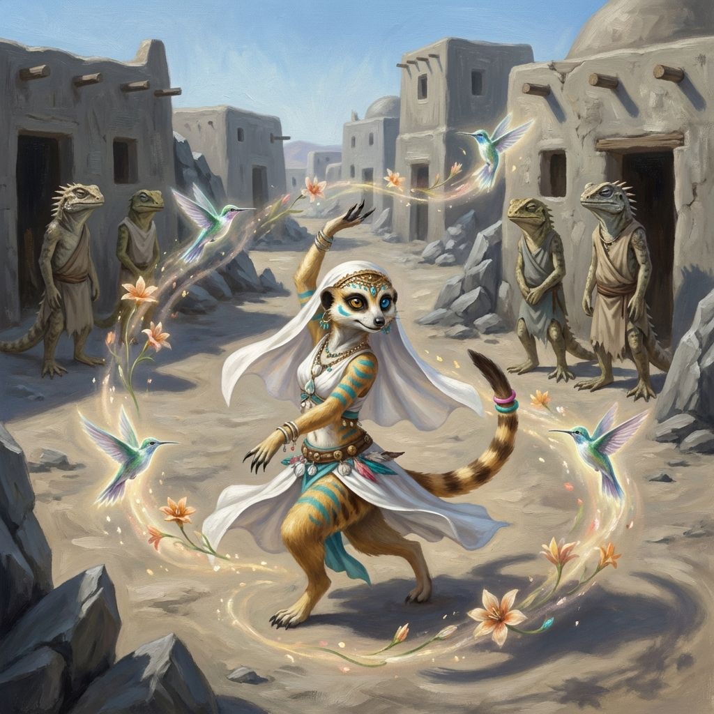

# Capítulo 1: O Oásis Desbotado

*Sob o sol inclemente, Samira dança rente ao chão poeirento, cercada por habitantes antropomórficos — os lagartos-espinhosos — que observam suas ilusões etéreas com uma mistura de cansaço e espanto.*

O sol do deserto de Eldoria castigava a areia com um fervor implacável. Ondas de calor subiam das dunas, distorcendo o horizonte e fazendo até as rochas mais estoicas parecerem tremer. Era nesse cenário impiedoso que Samira, A Dançarina das Miragens, costumava encontrar sua maior inspiração. Para ela, o deserto não era vazio; era uma tela em branco, esperando para ser preenchida com a cor e o movimento de sua arte.

Hoje, porém, seu espírito vibrante estava um pouco murcho, como uma flor do deserto sob o sol do meio-dia. Ela chegara ao Oásis da Rocha Cinzenta, um pequeno aglomerado de cabanas de barro e tendas esfarrapadas aninhado entre formações rochosas desgastadas pelo vento. O nome, ela percebeu com um aperto no coração, era terrivelmente apropriado. Tudo ali parecia desbotado: a vegetação rasteira ao redor da fonte de água era escassa e amarelada, as pelagens das criaturas – em sua maioria lagartos-espinhosos e alguns camelos magros – eram opacas pela poeira, e até o ar parecia pesado, sem a brisa dançante que Samira tanto amava. Entalhes que um dia deveriam ter sido vibrantes nas portas das cabanas estavam rachados e cobertos de poeira, e pequenos talismãs de conchas pendurados nas entradas pareciam sem brilho e esquecidos.

Mas Samira não se deixava abater facilmente. Ela era uma dançarina, afinal! Sua missão era trazer cor e vida onde quer que fosse. Com um rodopio gracioso que fez seus véus translúcidos esvoaçarem como asas de borboleta, ela se posicionou no centro da pequena praça do oásis. Sua pelagem dourada brilhava sob o sol, um contraste gritante com a monotonia do lugar. Seus grandes olhos, um âmbar e outro violeta, faiscaram com determinação.

Então, ela começou a dançar. Seus movimentos eram fluidos como água, mas com a energia crepitante do fogo do deserto. Seus pés mal tocavam a areia enquanto ela girava, saltava e se contorcia, a cauda longa e expressiva acompanhando cada gesto. E, com a dança, veio a magia. Do ar rarefeito, imagens tremeluzentes começaram a surgir – flores impossíveis, pássaros de luz, cascatas de areia brilhante. Era uma dança de pura beleza *moderna*, uma celebração da vida em meio à aridez, como Samira acreditava que a arte deveria ser: nova, vibrante, sua.

Algumas criaturas do oásis pararam seus afazeres para observar. Filhotes de lagarto apontavam com curiosidade, e um velho camelo ergueu a cabeça lentamente. Havia um brilho momentâneo em seus olhos cansados. Samira sentiu uma pontada de esperança. Sua arte estava alcançando-os!

Mas a esperança durou pouco. Logo, os olhares se desviaram. Os ombros voltaram a se curvar sob o peso do desânimo. A dança continuou, as ilusões cintilaram, mas a audiência parecia incapaz de absorver a beleza que lhes era oferecida. Era como jogar pétalas de flor em uma rocha – elas simplesmente caíam, ignoradas.

Quando Samira finalmente parou, ofegante, o único som que ouviu foi o do vento sussurrando entre as rochas. Ninguém aplaudiu. Ninguém sorriu. Apenas o mesmo silêncio pesado de antes.

Pela primeira vez em muito tempo, a pequena suricate sentiu uma pontada de dúvida. Sua arte, normalmente tão vibrante e contagiante, parecia ter perdido seu poder naquele lugar. As miragens que ela criara pareceram subitamente frágeis, quase transparentes, como se a própria apatia do oásis, a falta de uma ressonância cultural, estivesse drenando sua magia.

Um velho lagarto-espinhoso, com a pele tão cinzenta quanto as rochas ao redor, aproximou-se lentamente. "Bela dança, jovem", disse ele, a voz rouca como areia rolando. "Mas a beleza não enche barrigas vazias, nem cura a sede”. Ele apontou para a fonte no centro do oásis. A água que brotava era um fio escasso, quase seco. "A fonte está morrendo", continuou o lagarto. "As plantas secam, os animais se vão. A esperança... a esperança também está secando, como a água. Não como nos velhos tempos”.

Samira olhou para a fonte moribunda, depois para os rostos resignados das criaturas ao redor. Aquele oásis não estava apenas desbotado; estava desesperado. E a desesperança, ela percebeu com um arrepio, era um veneno sutil, atrelado a algo mais profundo do que apenas a falta d'água. O problema do Oásis da Rocha Cinzenta, de alguma forma, havia se tornado seu problema também.