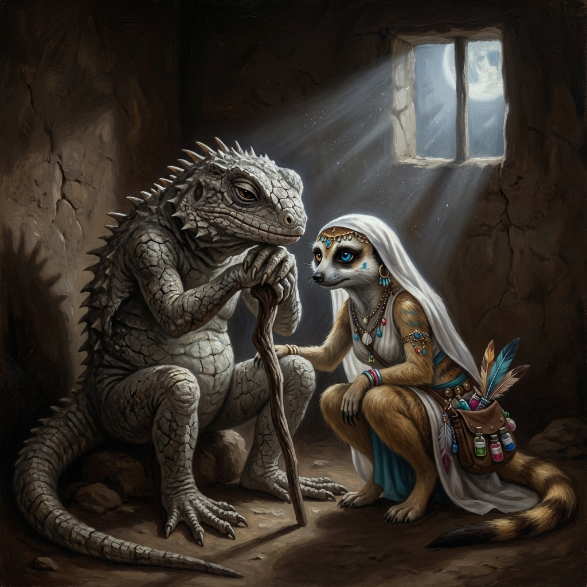

# Capítulo 2: O lamento do Ancião Lagarto

*Na penumbra da cabana, Samira ouve com empatia o lamento do ancião sobre as memórias perdidas do oásis.*

A sensação era desconcertante. Samira estava acostumada a ser o centro das atenções, a sentir a energia do público fluir para ela, alimentando sua magia. Ali, no Oásis da Rocha Cinzenta, era o oposto: o lugar parecia sugar sua vitalidade, deixando suas ilusões pálidas e seus movimentos menos inspirados. A fraqueza em sua própria magia, espelhando a fraqueza da fonte, a incomodava profundamente. Deixar aquele lugar, naquele estado, pareceu-lhe subitamente impensável. Era uma afronta à sua própria natureza.

"Os velhos tempos?", perguntou Samira ao lagarto ancião, aproximando-se com uma curiosidade que superava seu desapontamento. "O que quer dizer?".

O lagarto suspirou um som seco como folhas mortas. "Ah, jovem dançarina... este oásis já foi diferente. A fonte jorrava forte, as plantas eram verdes, e havia... alegria”. E gesticulou com a cabeça enrugada na direção de alguns jovens lagartos que chutavam pedrinhas com apatia. "Eles não se lembram. Ninguém mais se importa com as canções, com os rituais que nossos pais nos ensinaram. Preferem as bugigangas que os mercadores trazem, as histórias vazias...”.

Samira franziu o nariz delicado. Rituais? Canções antigas? Aquilo soava terrivelmente parecido com as tradições rígidas e sem vida que a fizeram deixar sua própria comunidade suricate. Lá, a arte tinha regras, a dança tinha passos fixos, e a espontaneidade era vista com desconfiança. Ela buscava a inovação, a liberdade de expressão.

"Mas o que canções têm a ver com a água?", ela perguntou, tentando manter o ceticismo fora de sua voz.

"Tudo!", respondeu o lagarto, os olhos pequenos brilhando com uma fagulha de convicção. "A fonte não é só água, é o espírito do oásis. Nossos pais sabiam como honrá-la, como pedir sua bênção. Havia a Dança da Primeira Chuva, o Canto da Lua Cheia... eram eles que mantinham a conexão forte. Agora... agora a conexão está morrendo, como a fonte."

Samira permaneceu em silêncio, pensativa. A ideia de magia ligada a rituais parecia-lhe antiquada. Sua própria magia vinha de dentro, de sua paixão, de sua criatividade. Mas a fraqueza que sentia, a forma como a desesperança do lugar parecia afetá-la... Talvez houvesse mais ali do que simples falta d'água.

Ela passou o resto do dia observando. Viu a forma como os habitantes interagiam – ou melhor, como *não* interagiam. Havia pouca conversa, menos risadas ainda. As crianças não brincavam com a energia habitual. Os anciãos sentavam-se à sombra, perdidos em memórias ou no vazio. Ela viu os talismãs empoeirados, os entalhes ignorados, as ferramentas cerimoniais enferrujando em um canto. Aquele lugar havia perdido sua alma.

Naquela noite, sob a luz fria das estrelas do deserto, Samira tomou uma decisão. Não seria fácil. Ela não entendia completamente o problema, e a ideia de depender de "velhos costumes" a desagradava. Mas a dançarina dentro dela não podia ignorar a dor daquele lugar. Ela ficaria. Ela tentaria ajudar. E, talvez, no processo, descobriria algo sobre sua própria arte e sobre a natureza da inspiração. Era uma promessa silenciosa, feita não aos habitantes do oásis, mas a si mesma e ao espírito murcho daquele lugar esquecido.