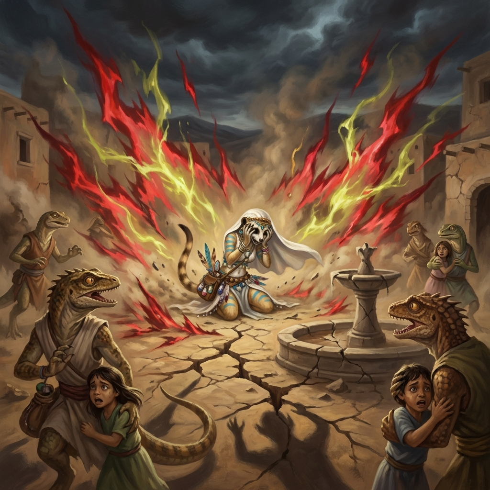

# Capítulo 5: O ritual profanado

*A tentativa desesperada de forçar um ritual resulta em magia distorcida e medo, enquanto a fonte estremece sob a força bruta.*

O desespero começava a tomar conta de Samira. Suas danças não funcionavam, sua exploração fora inconclusiva. O oásis estava morrendo, e sua própria magia parecia desvanecer junto com ele. Ela precisava tentar algo drástico, algo que provasse o poder de sua arte, mesmo que à força.

Lembrou-se dos símbolos que vira nas ruínas do santuário, dos entalhes que mostravam criaturas dançando ao redor da água. Lembrou-se das palavras do velho lagarto sobre rituais e conexão. E se ela recriasse um desses rituais? Mas do *seu* jeito? Com *sua* magia? Talvez uma demonstração de poder pudesse chocar o espírito da fonte de volta à vida.

Reuniu os poucos habitantes que ainda tinham alguma energia na praça central. "Eu sei como trazer a água de volta!", anunciou, com uma confiança que não sentia. "Precisamos mostrar à fonte que ainda nos importamos! Precisamos dançar!".

Ela começou a se mover, tentando imitar os poucos gestos que decifrara dos entalhes, mas rapidamente os abandonou em favor de sua própria coreografia. Era uma dança frenética, quase desesperada. Ela invocou suas ilusões, mas desta vez, elas não eram belas flores ou pássaros de luz. Eram imagens da fonte jorrando com força, de plantas crescendo viçosas, de criaturas celebrando. Eram miragens de abundância, criadas com toda a energia que lhe restava.

Mas havia algo errado. Sua magia, enfraquecida pela apatia do lugar e distorcida por seu desespero, não respondeu como esperado. As ilusões eram instáveis, cintilantes demais, quase agressivas. As imagens da água pareciam ondas raivosas, as plantas cresciam de forma monstruosa e contorcida, os animais pareciam selvagens e ameaçadores. A música do vento, que ela tentava conjurar, tornou-se um uivo dissonante. Era uma caricatura grotesca da vida, não uma celebração.

Os habitantes recuaram, assustados. Os filhotes começaram a chorar. O velho lagarto balançou a cabeça em reprovação. "Não é assim, jovem", murmurou ele. "Você não entende... Falta respeito. Falta coração”.

A própria fonte pareceu reagir negativamente. A água, que antes gotejava, parou completamente por um instante. Um tremor percorreu o chão, e um som gutural, como um gemido de dor, ecoou das profundezas da terra.

Então, a magia de Samira se estilhaçou. As ilusões desapareceram em uma explosão de luz ofuscante, deixando apenas a poeira e o silêncio. Samira caiu de joelhos, exausta, humilhada e completamente desanimada. Sua tentativa de misturar sua arte com uma tradição mal compreendida havia sido um desastre. Ela não só falhara em ajudar, como talvez tivesse piorado as coisas, ofendendo o próprio espírito do lugar.

Olhou para os rostos assustados e desapontados ao seu redor. Viu a fonte completamente seca. Sentiu sua própria magia reduzida a uma faísca quase apagada. Era o seu ponto mais baixo. Sua arte, sua paixão, seu propósito como dançarina... tudo parecia inútil diante da dura realidade daquele lugar moribundo. A dúvida que sentira antes agora era uma certeza esmagadora: ela havia falhado. Talvez o velho lagarto estivesse certo. Talvez ela realmente não entendesse nada sobre a verdadeira conexão entre a arte, a vida e a tradição.